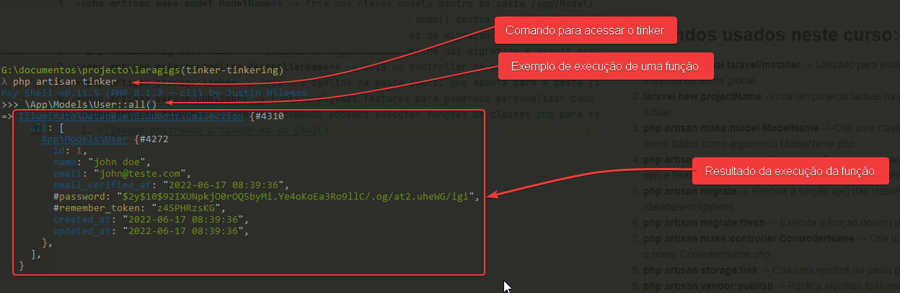

# Laragigs
Projecto realizado com base no video [Laravel From Scratch 2022 | 4+ Hour Course](https://youtu.be/MYyJ4PuL4pY)

## Comandos usados neste curso:
1. **composer global require laravel/installer** -> Utilizado para instalar o criador de projectos laravel na sua máquina de forma global.
2. **laravel new projectName** -> cria um projecto laravel na pasta com o nome projectNew, no directorio actual.
3. **php artisan make:model ModelName** -> Cria uma classe modelo dentro da pasta /app/Model/ com o nome dados como argumento ModelName.php
4. **php artisan migrate:refresh --seed** -> Executa a funçao down() dentro das migration e depois executa up() e finaliza alimentando o banco com os dados definidos no ficheiro /database/seeders.
5. **php artisan migrate** -> executa a função up() das classes de migração que estão em /database/migations.
6. **php artisan migrate:fresh** -> Executa a funçao down() dentro das migration e depois executa up()
7. **php artisan make:controller ControllerName** -> Cria um controller na pasta /app/Http/Controllers/ com o nome ControllerName.php;
8. **php artisan storage:link** -> Cria uma symlink na pasta public que aponta para a pasta /storage/app
9. **php artisan vendor:publish** -> Publica algumas features para podermos personalizar como paginação e outras coisas.
10. **php artisan tinker** -> Com esse comando podemos executar funções de classes php para testes, devemos passar o namespace da classe e a função que desejamos executar.
    1. 
